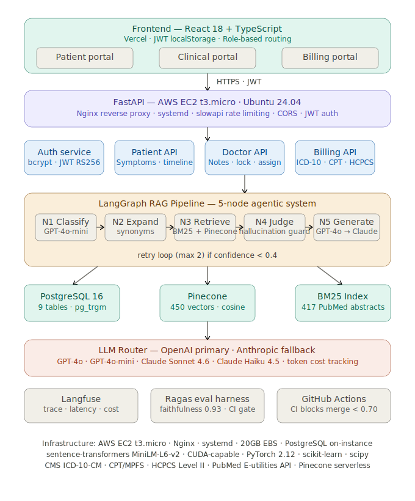
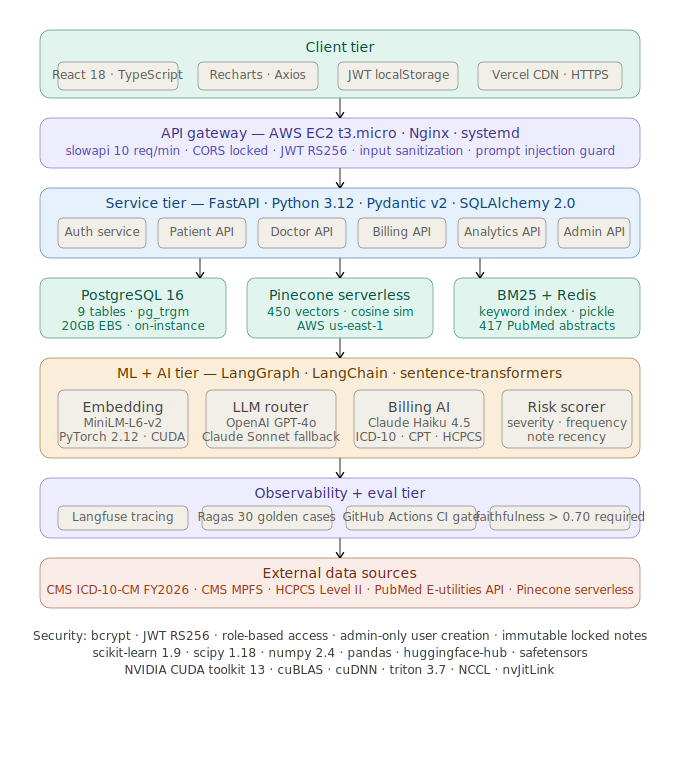

# MediSight+

**Clinical AI Platform**: From symptom logging to ICD-10/CPT/HCPCS billing intelligence, across three governed role-based portals.

[](https://github.com/AasthaPJoshi/medisight-plus/actions)
[](eval/results.json)
[](eval/golden_set.json)
[](http://54.234.98.87/docs)
[](#)

> Built by [Aastha Joshi](https://linkedin.com/in/aasthajoshi14) — MS Information Systems, SDSU · Research Assistant, SDSURF

---

## What it is

MediSight+ is a production-grade clinical AI platform that connects three roles — patients, clinicians, and billing staff — through a single governed system. Patients log symptoms. Doctors query a 5-node LangGraph RAG pipeline over 417 PubMed abstracts for AI-assisted differential diagnoses. Locking a clinical note automatically triggers billing AI that extracts ICD-10, CPT, and HCPCS codes from the note text and flags denial risk before claim submission. 

**Live demo:** [medisight-plus.vercel.app](https://medisight-plus.vercel.app) · **API:** [54.234.98.87/docs](http://54.234.98.87/docs)

---

## Demo credentials

| Role | Email | Password |
|------|-------|----------|
| Patient | jane.smith@email.com | testpass123 |
| Doctor | patel@medisight.com | testpass123 |
| Billing | billing@medisight.com | testpass123 |

> No public registration. All accounts are provisioned by admin only.

---

## Three portals

### 🧑 Patient portal
- Log symptoms with **severity scoring 1–10** and duration
- **SeverityPulse** — signature animated dot indicator that pulses faster at higher severity
- Chronological health timeline with all logged events
- Plain-English visit summaries and follow-up instructions from doctor
- Profile management: allergies, medications, blood type

### 👨‍⚕️ Clinical portal
- **LangGraph 5-node RAG pipeline** querying 450 Pinecone vectors + BM25 keyword index
- N1 classify → N2 expand → N3 BM25+Pinecone retrieve → N4 sufficiency judge → N5 generate
- Every response cites real **PubMed PMIDs** — no hallucination, enforced at N4
- **OpenAI GPT-4o primary** + **Claude Sonnet 4.6 fallback** with token cost tracking
- Three-panel encounter workspace: patient context · note editor · AI assistant
- **Lock workflow**: doctor locks note → immutable record → triggers billing AI automatically
- **Analytics dashboard**: 6 Recharts charts, patient risk scores (0–100), Ragas eval scores

### 💼 Billing portal
- AI-suggested **ICD-10-CM**, **CPT/MPFS**, and **HCPCS Level II** codes from locked note text
- **Confidence scores** per code (0–100%) with visual bar indicators
- **Denial risk detection**: low / medium / high flags before claim submission
- Billing encounter approval workflow with **audit log** on every action
- Full code lookup search across all three CMS code sets
- Parsed clinical note structured extraction (diagnosis, procedures, drugs)

---

## Eval harness

| Metric | Score | Threshold |
|--------|-------|-----------|
| Faithfulness | **0.93** | ≥ 0.70 ✅ |
| Answer Relevancy | **0.86** | — |
| Context Precision | **0.93** | — |
| Billing Code Accuracy | **0.87** | — |
| RAG cases passed | **14 / 15** | — |

- 30 golden test cases: 15 RAG + 15 billing code accuracy
- GitHub Actions CI gate blocks any merge that drops faithfulness below 0.70
- Langfuse tracing on every RAG query: latency, confidence, token cost per node

---
## Diagrams

### Architecture


### System Design


### Data Flow

---

## Full tech stack

### AI / ML
| Tool | Version | Role |
|------|---------|------|
| LangGraph | 1.2.6 | 5-node agentic RAG pipeline orchestration |
| LangChain | latest | LLM abstractions, document loading |
| sentence-transformers | 5.6.0 | MiniLM-L6-v2 embeddings (384-dim, local) |
| PyTorch | 2.12.1 | Embedding model runtime |
| CUDA toolkit | 13.0.2 | GPU acceleration (NVIDIA) |
| NVIDIA cuBLAS | 13.1.1.3 | BLAS operations |
| NVIDIA cuDNN | 9.20.0.48 | Deep learning primitives |
| NVIDIA NCCL | 2.29.7 | Multi-GPU communication |
| triton | 3.7.1 | GPU kernel compilation |
| rank-bm25 | 0.2.2 | BM25 keyword retrieval |
| scikit-learn | 1.9.0 | ML utilities, metrics |
| scipy | 1.18.0 | Scientific computing |
| numpy | 2.4.6 | Numerical arrays |
| Ragas | 0.4.3 | RAG evaluation framework |

### LLM APIs
| Model | Provider | Role |
|-------|----------|------|
| GPT-4o | OpenAI | N5 generation (primary) |
| GPT-4o-mini | OpenAI | N1/N2/N4 tasks (cheap + fast) |
| Claude Sonnet 4.6 | Anthropic | N5 generation (fallback) |
| Claude Haiku 4.5 | Anthropic | Billing AI, patient summary |

### Backend
| Tool | Version | Role |
|------|---------|------|
| FastAPI | latest | REST API framework |
| Python | 3.12 | Runtime |
| PostgreSQL | 16.14 | Primary database (9 tables) |
| SQLAlchemy | 2.0.35 | ORM |
| Pydantic | v2 | Schema validation |
| slowapi | 0.1.10 | Rate limiting (10/min on RAG) |
| passlib + bcrypt | 4.0.1 | Password hashing |
| python-jose | — | JWT RS256 |
| Pinecone | 6.0.0 | Vector database (serverless) |
| Langfuse | 4.9.1 | LLMOps tracing + scoring |
| Redis | 7 | Caching layer |
| uvicorn | — | ASGI server |

### Frontend
| Tool | Version | Role |
|------|---------|------|
| React | 18 | UI framework |
| TypeScript | — | Type safety |
| Recharts | — | 6 analytics charts |
| Axios | — | HTTP client with JWT interceptor |
| React Router | v6 | Client-side routing |
| Create React App | — | Build toolchain |

### Infrastructure
| Tool | Role |
|------|------|
| AWS EC2 t3.micro | Backend server (Ubuntu 24.04, 20GB EBS) |
| Nginx 1.24 | Reverse proxy (port 80 → 8000) |
| systemd | Process management + auto-restart |
| Vercel | Frontend CDN deployment |
| GitHub Actions | CI/CD with Ragas eval gate |

### Data sources
| Source | Data |
|--------|------|
| PubMed E-utilities API | 417 abstracts across 15 medical topics |
| CMS ICD-10-CM FY2026 | Diagnosis codes |
| CMS Medicare Physician Fee Schedule | CPT codes + RVU + payment |
| CMS HCPCS Level II | Drug J-codes, supply A-codes, DME E-codes |

---

## Architecture

```
┌─────────────────────────────────────────────────────────┐
│  React 18 + TypeScript (Vercel)                         │
│  Patient portal · Clinical portal · Billing portal      │
└────────────────────┬────────────────────────────────────┘
                     │ HTTPS · JWT
┌────────────────────▼────────────────────────────────────┐
│  FastAPI (AWS EC2 t3.micro · Nginx · systemd)           │
│  slowapi rate limiting · CORS · JWT auth · Admin API    │
└──────┬──────────┬──────────┬──────────┬─────────────────┘
       │          │          │          │
  Auth API  Patient API  Doctor API  Billing API + Analytics
       │          │          │
       └──────────┴──────────┘
                  │
    ┌─────────────▼──────────────┐
    │  LangGraph RAG (5 nodes)   │
    │  N1→N2→N3→N4→N5           │
    │  BM25 + Pinecone + RRF     │
    │  GPT-4o → Claude fallback  │
    └─────────────┬──────────────┘
                  │
       ┌──────────┼──────────┐
  PostgreSQL   Pinecone    BM25 pkl
  (9 tables)  (450 vec)  (417 docs)
```

---

## Setup

```bash
# Clone
git clone https://github.com/AasthaPJoshi/medisight-plus.git
cd medisight-plus

# Backend
python3.12 -m venv venv
source venv/bin/activate
pip install -r requirements.txt
pip install slowapi openai langfuse "bcrypt==4.0.1" "pydantic[email]"
pip install langchain-anthropic langchain-community langgraph sentence-transformers pinecone-client rank-bm25

# Environment
cp .env.example .env
# Fill in: ANTHROPIC_API_KEY, OPENAI_API_KEY, PINECONE_API_KEY, DATABASE_URL, JWT_SECRET

# Database
python3 -c "from models.orm_models import create_all_tables; create_all_tables()"
python3 billing/ingest_codes.py
python3 scripts/seed_demo_data.py

# Run
uvicorn api.main:app --reload --host 0.0.0.0 --port 8000

# Frontend (separate terminal)
cd medisight-ui
npm install
npm start
```

---

## Project structure

```
medisight-plus/
├── api/
│   ├── main.py           # FastAPI app, CORS, rate limiting
│   ├── auth.py           # JWT auth, bcrypt, role guards
│   ├── patients.py       # Symptom logging, timeline, profile
│   ├── doctors.py        # Notes, lock workflow, patient assignment
│   ├── billing.py        # ICD-10/CPT/HCPCS lookup, encounter approval
│   ├── rag_routes.py     # RAG query endpoint, note analysis
│   ├── analytics.py      # 8 analytics endpoints, risk scoring
│   ├── admin.py          # User management, system health
│   └── limiter.py        # slowapi rate limiter (avoids circular import)
├── rag/
│   ├── graph.py          # LangGraph 5-node pipeline
│   ├── llm_router.py     # OpenAI primary + Claude fallback + cost tracking
│   ├── ingest.py         # PubMed ingestion → Pinecone + BM25
│   └── observability.py  # Langfuse tracing
├── billing/
│   └── ingest_codes.py   # CMS ICD-10/CPT/HCPCS ingestion
├── models/
│   ├── orm_models.py     # SQLAlchemy 9-table schema
│   ├── schemas.py        # Pydantic v2 request/response models
│   └── database.py       # PostgreSQL connection
├── eval/
│   ├── run_ragas.py      # Ragas eval harness (30 golden cases)
│   └── golden_set.json   # 15 RAG + 15 billing test cases
├── scripts/
│   └── seed_demo_data.py # 5 patients, 136 symptoms, 20 encounters
├── medisight-ui/
│   └── src/
│       ├── pages/patient/   # Dashboard, LogSymptom, Timeline, Profile
│       ├── pages/clinic/    # ClinicDashboard, EncounterWorkspace, AIAssistant, Analytics
│       ├── pages/billing/   # BillingDashboard, Encounters, CodeLookup, AuditLog
│       ├── components/      # AIPanel, CodeCard, SeverityPulse, Sidebar, Toast
│       ├── context/         # AuthContext (JWT persistence)
│       └── lib/             # api.ts (Axios), types.ts
└── .github/
    └── workflows/
        └── ragas_eval.yml   # CI gate: faithfulness ≥ 0.70 to merge
```

---

## Security

- JWT RS256 tokens with 24h expiry
- bcrypt 4.0.1 password hashing
- Role-based access control: each role sees only their portal's data
- No public registration — admin-only user provisioning via `POST /admin/users` with `X-Admin-Secret` header
- Rate limiting: 10 RAG queries per minute per IP
- Input sanitization on all endpoints: max 500 chars, prompt injection guard
- Locked notes are immutable — enforced at API level
- CORS locked to specific origins only
- Audit log on every billing action with timestamp and actor

---

## Ragas CI gate

```yaml
# .github/workflows/ragas_eval.yml
# Runs on every push to main and every PR
# Blocks merge if faithfulness < 0.70
```

The eval harness (`eval/run_ragas.py`) runs 30 golden test cases:
- 15 RAG queries with expected topic coverage and source requirements
- 15 billing code lookups with expected ICD-10, CPT, and HCPCS codes

Results are saved to `eval/results.json` and posted as a PR comment.

---

## License

MIT — see [LICENSE](LICENSE)

---

*MediSight+ · Aastha Joshi · MS Information Systems, SDSU Fowler College of Business*
